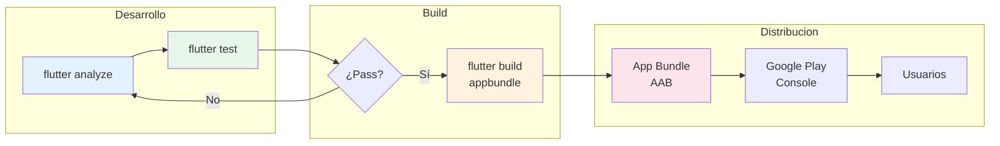

# Build y Distribución Profesional {#sec-build}

> **Relación con Testing**: Antes de generar el build de producción, ejecuta los tests automatizados. Ver [@sec-testing] para más detalles.

> **Relación con Performance**: Un build optimizado es crucial. Consulta [@sec-performance] para reducir el tamaño del APK/AAB antes de subir a las tiendas.

Tu aplicación está lista, pero antes de que llegue a las manos de los usuarios, debemos prepararla para el mundo real. Como facilitador, te guiaré en el proceso de generar versiones optimizadas y seguras.

## Pipeline de Build



**Flujo**: Analyze → Test → Build → Distribute. Nunca publiques sin pasar los tests.

## Modos de Compilación

1. **Debug Mode**: Para desarrollo local. Incluye aserciones y Hot Reload. No es representativo del rendimiento final.
2. **Profile Mode**: Para analizar el rendimiento (jank, memoria). No se puede usar en emuladores.
3. **Release Mode**: El que enviamos a las tiendas. Código minificado, sin debug symbols y optimizado para velocidad.

## Generación de APK y AAB (Android)

Para publicar en Google Play, es obligatorio usar el formato **App Bundle (AAB)**.

```bash
# Generar APK (para pruebas rápidas)
flutter build apk --release

# Generar App Bundle (para Google Play)
flutter build appbundle --release
```

## Firma de la Aplicación

Nunca compartas tu archivo de `keystore` ni las contraseñas. Úsalas mediante un archivo `key.properties` que **debe estar en tu .gitignore**.

::: {.callout-important}
## QA (Quality Assurance)
Antes de subir tu app, pruébala en al menos dos dispositivos físicos diferentes. Los emuladores a veces ocultan errores de rendimiento o de permisos que solo aparecen en hardware real.
:::

::: {.anti-ia-challenge}
**Optimización de Tamaño**: Una app de Flutter en release puede pesar 15-20MB. ¿Qué técnica usarías para reducir aún más el tamaño del APK/AAB? (Pista: investiga el flag `--split-debug-info` y el uso de `Proguard`).
:::
