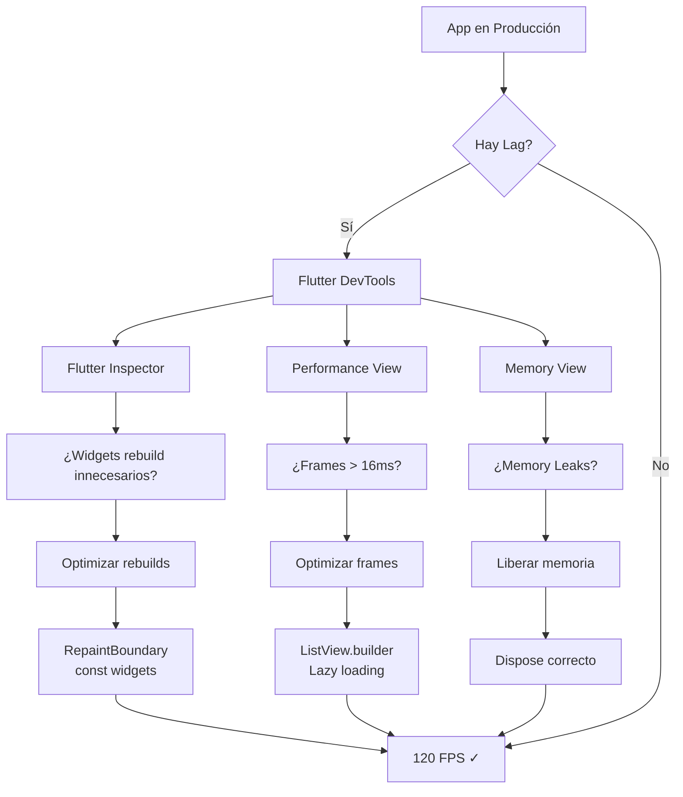

# Optimización: De "Funciona" a "Vuela" {#sec-performance}

La [@sec-capas-sagradas] bien implementada es la base del rendimiento. Una arquitectura limpia facilita el profiling preciso porque cada capa tiene responsabilidades definidas.

> **Relación con Build**: Para medir rendimiento real, usa `flutter build apk --release` (no debug) como se explica en [@sec-build].

Si tu app tiene lag, no es Flutter; es TU CÓDIGO. Aquí NO nos conformamos con que una app "funcione". Una app profesional debe correr a 120 FPS sin parpadear. El rendimiento no es un "extra", es una **OBLIGACIÓN TÉCNICA**.

## Flutter DevTools: Tu mejor amigo

Aprenderás a usar el set de herramientas de Flutter como un cirujano. No adivines dónde está el problema, **MIDELO**.



::: {.concept-note}
**Arquitectura → Rendimiento**: Una [@sec-clean-architecture] bien implementada facilita el profiling porque cada capa tiene responsabilidades claras. El estado que viene de [@sec-gestion-estado] debe minimizarse para evitar rebuilds innecesarios.
:::

1. **FLUTTER INSPECTOR**: Para cazar esas reconstrucciones inútiles que matan la CPU.
2. **PERFORMANCE VIEW**: Para analizar el Raster Thread. Si tus frames tardan más de 8ms, estás en problemas.
3. **MEMORY VIEW**: Para DESTRUIR los memory leaks antes de que tu app explote en producción.

## Mis Reglas de Oro para la Fluidez

- **CONST ES LEY**: Si un widget puede ser `const`, DEBE ser `const`. Ayuda al framework a reutilizar el árbol.
- **LISTVIEW.BUILDER**: Solo un principiante usa `ListView` simple con miles de elementos. Usa constructores perezosos.
- **REPAINTBOUNDARY**: Aísla las animaciones pesadas. No redibujes toda la pantalla por un simple cronómetro.

```dart
// Si no usas RepaintBoundary aquí, estás desperdiciando recursos
RepaintBoundary(
  child: MyComplexAnimation(),
)
```

::: {.anti-ia-challenge}
**DIAGNÓSTICO DE ÉLITE**: Si notas que tu app pierde frames solo en el primer scroll, pero luego va fluida, ¿qué concepto de pre-compilación de Shaders (Skia/Impeller) explicarías a tu equipo para solucionar este problema técnico?
:::
