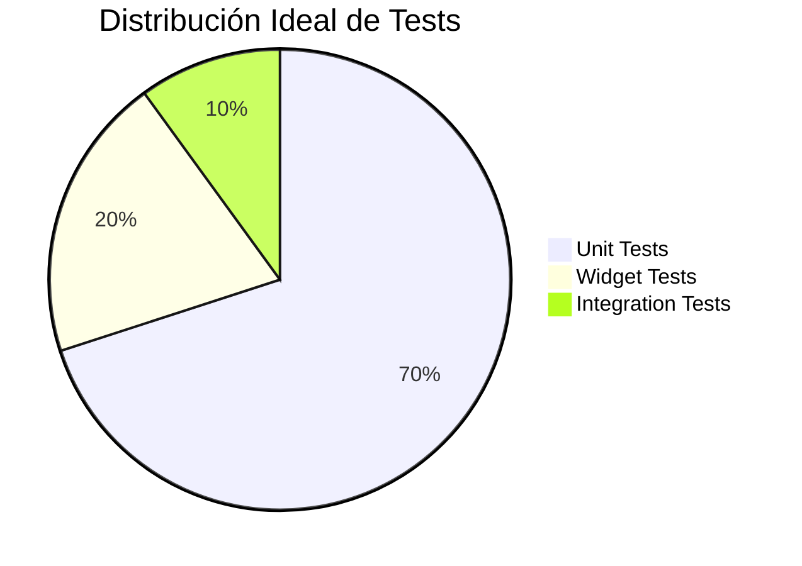

# Testing y CI/CD: El Escudo del Desarrollador {#sec-testing}

Un desarrollador mediocre dice: "Mi código funciona porque lo probé en el emulador". Un **INGENIERO** dice: "Mi código funciona porque tengo una suite de tests que lo garantiza". Aquí NO aceptamos código sin pruebas — el testing es OBLIGATORIO.

> **Relación con Clean Architecture**: Los Unit Tests prueban la capa DOMAIN (lógica de negocio). Ver [@sec-clean-architecture].

## La Pirámide de Pruebas en Flutter

1. **UNIT TESTS**: Pruebas de lógica pura (Domain). Son rápidas y DEBEN ser el 70% de tus pruebas.
2. **WIDGET TESTS**: Pruebas de UI. Verifican que un botón dispare la acción correcta.
3. **INTEGRATION TESTS**: Pruebas de flujo completo en un dispositivo real o emulador.
4. **GOLDEN TESTS**: Capturas visuales para evitar que un cambio de CSS rompa el diseño.

## Pirámide de Testing



**Meta**: 70% Unit, 20% Widget, 10% Integration. Los unit tests son más rápidos y confiables.

## Integración Continua (CI) con GitHub Actions

No queremos que subas código roto al repositorio. Configuraremos un flujo automatizado que:
- Ejecute el linter (análisis estático).
- Corra todos los tests.
- Genere el build de la app.

```yaml
# .github/workflows/flutter_ci.yml
name: Flutter CI

on: [push, pull_request]

jobs:
  test:
    runs-on: ubuntu-latest
    steps:
      - uses: actions/checkout@v3
      - uses: subosito/flutter-action@v2
      - run: flutter pub get
      - run: flutter analyze
      - run: flutter test
```

::: {.anti-ia-challenge}
**DESAFÍO DE DEVOPS**: Si un test de integración falla en el CI pero pasa en tu computadora local, ¿cuáles serían las 3 posibles causas técnicas relacionadas con el entorno (Environment) que investigarías primero?
:::
