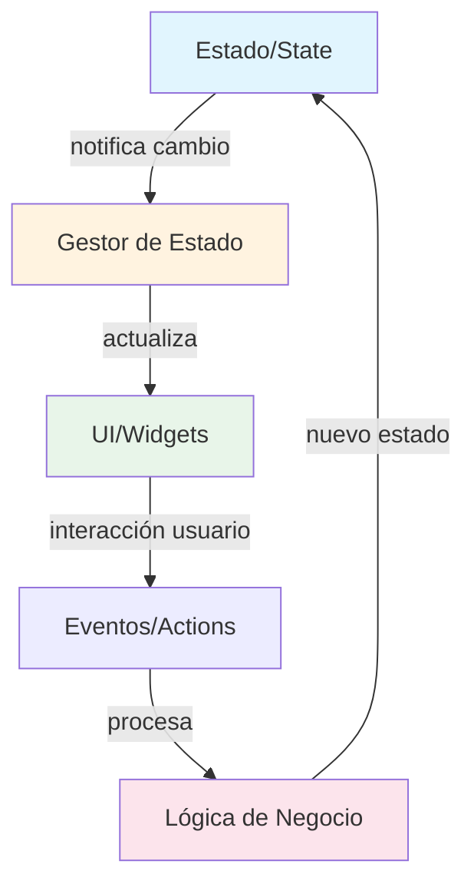

# Gestión de Estado: El Alma de tu App {#sec-gestion-estado}

> **Relación con Clean Architecture**: El estado pertenece a la capa DOMAIN. Los gestores de estado como Riverpod son la implementación del patrón Observer. Ver [@sec-clean-architecture] para entender cómo se integra con las capas.

Si no dominas el estado, no dominas Flutter. Punto. Como facilitador, veo demasiados programadores que ensucian su código con `setState` en lugares donde NO debería estar. El estado no es solo "hacer que algo cambie en pantalla", es la **VERDAD ÚNICA** de tu aplicación en un momento dado.

## ¿Por qué importa la arquitectura de estado?

Cuando tu app crece, el código espagueti de pasar datos entre constructores se vuelve una PESADILLA técnica. Un buen Ingeniero de Software busca:

1. **SEPARACIÓN DE INTERESES**: Tu UI no debe saber CÓMO se calculan los datos, solo debe mostrarlos.
2. **INMUTABILIDAD**: El estado no se "modifica", se reemplaza por uno nuevo para garantizar predictibilidad.
3. **REACTIVIDAD**: Tu interfaz debe ser un reflejo automático de tus datos.

## Flujo de Datos en Gestión de Estado

**Flujo unidireccional**: El estado fluye en una sola dirección: Estado → UI. Los eventos de la UI vuelven a través de acciones que procesan la lógica de negocio y generan un nuevo estado.

## El Gran Error del Novato

El mayor pecado es mezclar la lógica de negocio con los Widgets. Si tu archivo `main.dart` tiene 500 líneas, ESTÁS HACIENDO LAS COSAS MAL. Aquí te enseñaremos a mantener tus Widgets "tontos" y tu lógica "inteligente" y centralizada.

::: {.anti-ia-challenge}
**EL DILEMA DEL ARQUITECTO**: Imagina que tienes una app con 50 pantallas y todas necesitan saber si el usuario tiene una suscripción activa. Si usas `setState` y pasas el dato por constructores, ¿cuántos archivos tendrías que modificar si el requerimiento cambia? Explica por qué un gestor de estado global es la ÚNICA solución profesional aquí.
:::
