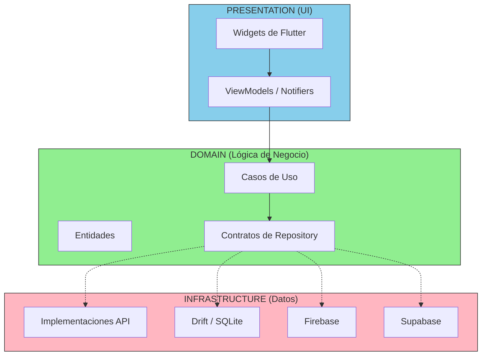
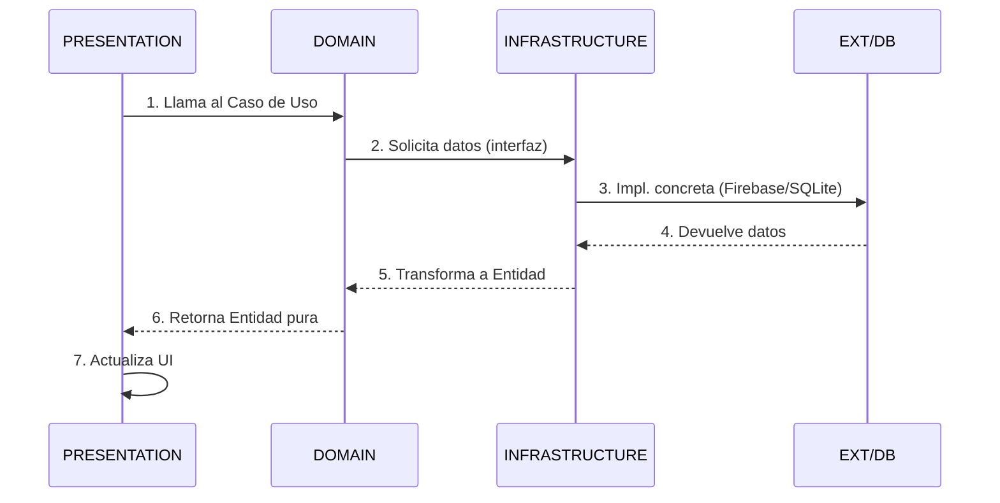

# Clean Architecture: Ingeniería, no solo Código {#sec-clean-architecture}

Aquí NO formamos "pica-teclas". Formamos **INGENIEROS**. La **Arquitectura Limpia** es la diferencia entre un programador que sobrevive al día a día y un arquitecto que diseña sistemas robustos que duran décadas. 

> 🎯 **Objetivo**: Al final de esta unidad serás capaz de estructurar cualquier aplicación Flutter con separación de responsabilidades profesional.

---

## 📚 Teoría: Los Fundamentos

Si programas pensando en el "ahora", tu código morirá mañana. Si programas con Arquitectura, tu código es ETERNO.

::: {.callout-tip}
## Por qué este capítulo es CRÍTICO

Clean Architecture es el fundamento de TODOS los capítulos posteriores de este curso. Sin dominarlo, cada solución que implementes será técnica debt acumulado. [@sec-capas-sagradas]
:::

## La Analogía del Edificio

Imagina que construyes una casa y pegas las tuberías directamente a las paredes con cemento. Si una tubería falla, tienes que DESTRUIR la pared. Eso es lo que haces cuando pegas tu lógica de negocio directamente a los Widgets de Flutter o a la base de datos de [@sec-firebase]Firebase[/ref] o [@sec-supabase]Supabase[/ref].

**Clean Architecture** nos permite tener "paredes" (UI) y "tuberías" (Lógica) separadas, para que podamos cambiar una sin afectar la otra.

# Las Capas son SAGRADAS {#sec-capas-sagradas}

## Diagrama de la Arquitectura



> **Nota**: Las flechas punteadas indican que el DOMAIN NO conoce la implementación. Solo conoce abstracciones (contratos).

::: {.panel-tabset}
## Capa 1: DOMAIN (El Corazón)

Aquí están tus Entidades y Casos de Uso. Es **Dart PURO**. No permitas que nada de Flutter entre aquí.

```dart
// ✅ ESTO VA EN DOMAIN - Es Dart puro
class User {
  final String id;
  final String email;
  final String name;
  
  User({required this.id, required this.email, required this.name});
  
  bool get isValid => email.contains('@') && name.isNotEmpty;
}
```

::: {.callout-warning}
## Error Común

NO imports `flutter/material.dart` en DOMAIN. Si lo haces, tu dominio depende de Flutter y pierde portabilidad. ❌
:::

## Capa 2: INFRASTRUCTURE

Aquí es donde "hablas" con el mundo exterior (APIs, DBs). Son los obreros que construyen las tuberías.

```dart
// ✅ ESTO VA EN INFRASTRUCTURE
import '../../domain/entities/user.dart';

abstract class UserRepository {
  Future<User> getUser(String id);
  Future<List<User>> getAllUsers();
}

class SupabaseUserRepository implements UserRepository {
  // Habla con Supabase - detalles de implementación
}
```

## Capa 3: PRESENTATION

Es solo la fachada. Flutter vive aquí. Es la capa más volátil y menos importante para la lógica de negocio.

```dart
// ✅ ESTO VA EN PRESENTATION
import 'package:flutter/material.dart';
import '../../domain/entities/user.dart';

class UserProfile extends StatelessWidget {
  final User user;
  
  @override
  Widget build(BuildContext context) {
    return Text(user.name);
  }
}
```
:::

### Ejemplo Completo: Flujo de Datos

::: {.panel-tabset}
## Sin Clean Architecture (EL MALO)

```dart
// ❌ ESTO ES LO QUE HACEN LOS "PICA-TECLAS"
class HomePage extends StatelessWidget {
  @override
  Widget build(BuildContext context) {
    // Lógica de negocio pegada al Widget
    final db = FirebaseFirestore.instance;
    
    return Scaffold(
      body: FutureBuilder(
        future: db.collection('users').get(),
        builder: (context, snapshot) {
          // UI + DATA todo mezclado
          return ListView(
            children: snapshot.data!.docs
                .map((doc) => Text(doc['name']))
                .toList(),
          );
        },
      ),
    );
  }
}
```

## Con Clean Architecture (EL BUENO)

```dart
// DOMAIN - Caso de Uso
class GetUsersUseCase {
  final UserRepository _repository;
  
  Future<List<User>> call() => _repository.getAllUsers();
}

// INFRASTRUCTURE - Repo implementación  
class FirebaseUserRepository implements UserRepository {
  @override
  Future<User> getUser(String id) async {
    final doc = await FirebaseFirestore.instance
        .collection('users')
        .doc(id)
        .get();
    return User.fromMap(doc.data()!);
  }
}

// PRESENTATION - Solo UI
class HomePage extends StatelessWidget {
  final GetUsersUseCase _getUsers;
  
  @override
  Widget build(BuildContext context) {
    return Scaffold(
      body: FutureBuilder(
        future: _getUsers(),
        builder: (context, snapshot) {
          return ListView(
            children: snapshot.data!
                .map((user) => Text(user.name))
                .toList(),
          );
        },
      ),
    );
  }
}
```
:::

## Cross-References entre Capas

Esta arquitectura se conecta con conceptos de otras unidades:

| Capa | Relaciona con | Why |
|------|--------------|-----|
| DOMAIN | [@sec-riverpod] Riverpod | Providers manejan casos de uso |
| INFRASTRUCTURE | [@sec-sqlite] SQLite/Drift | Repository pattern + DAOs |
| PRESENTATION | [Unidad 4: Widgets] | Solo recibe y renderiza datos |

## Flujo de Datos: Cómo viaja la información



> **Importante**: El PRESENTATION solo conoce el DOMAIN. NUNCA llama directamente a Firebase o SQLite desde los Widgets.

> **Nota**: El patrón Repository de [@sec-sqlite] es fundamental para la capa de INFRASTRUCTURE, permitiendo cambiar la implementación de base de datos sin afectar el DOMAIN.

## Preguntas de Comprensión

Antes de继续, responde estas preguntas para verificar tu entendimiento:

::: {.callout-question collapse="true"}
## ⭐ Pregunta 1: Identificación de Capas

En el siguiente código, identifica qué capa representa cada parte:

```dart
class FirebaseAuthService implements AuthService {
  @override
  Future<User> login(String email, String password) async {
    final credential = awaitFirebaseAuth.signInWithEmailAndPassword(
      email: email,
      password: password,
    );
    return User(id: credential.user!.uid, email: email);
  }
}
```

**Respuesta**: INFRASTRUCTURE -因为 implementa un contrato (AuthService) y habla con Firebase. ✅
:::

::: {.callout-question collapse="true"}
## ⭐ Pregunta 2: Por qué el Dominio es "puro"?

Por qué el DOMAIN debe ser 100% Dart sin dependencias externas?

**Pistas**:
1. Imagina que mañana quieres usar este código en una API REST
2. O en un script de CLI
3. O en Flutter Web

**Respuesta**: Porque así el dominio es portable a cualquier plataforma. No depends de Flutter ni de ninguna infraestructura específica. ✅
:::

# DESAFÍO DE INGENIERÍA {#sec-desafio-ingeneria}

::: {.anti-ia-challenge}
**CASO REAL**: Si decides cambiar de Supabase a una base de datos propia, y tienes bien aplicada la Clean Architecture, ¿qué archivos del DOMAIN deberías tocar? Si tu respuesta es "ninguno", vas por buen camino. Explica técnicamente POR QUÉ el dominio no debe cambiar ante un cambio de infraestructura.

**Puntos extra** si explicas:
- ¿Qué archivos SÍ necesitarían cambio?
- ¿Cuánto tiempo te ahorra tener el dominio separado?
:::

---

## 🚀 Práctica: Ejercicios de Refactorización

::: {.callout-important collapse="true"}
### Ejercicio 1: Refactoriza este código mal

```dart
// Este código tiene TODOS los problemas de Clean Architecture
class MiPagina extends StatelessWidget {
  final db = FirebaseFirestore.instance;
  final http = HttpClient();
  
  Future<void> guardarDatos() async {
    final response = await http.post(
      'https://miapi.com/datos',
      body: jsonEncode({'fecha': DateTime.now()}),
    );
    await db.collection('logs').add({'response': response});
  }
}
```

**Tu misión**: Separa este código en las 3 capas correctas. Sube tu solución al repositorio ytaguéame en Twitter (@statick88) para revisión. 

**Premio**: El mejor código publicado recibefeedback personalizado en el siguiente directo.

:::

::: {.callout-tip collapse="true"}
### Ejercicio 2: Investiga y Presenta

Estudia estos temas para el próximo capítulo:

1. **Entity vs Model vs DTO** - ¿Cuál es la diferencia?
2. **Repository Pattern** - Why overkill en proyectos pequeños?
3. **Dependency Injection** - Por qué Flutter usa Injection heredado?

**Recurso recomendado**: Clean Architecture en Flutter - Reso Coder (YouTube) [^1]
:::

## Footnotes

[^1]: Clean Architecture en Flutter por Reso Coder - [YouTube](https://www.youtube.com/watch?v=aspbV-aUqBc)