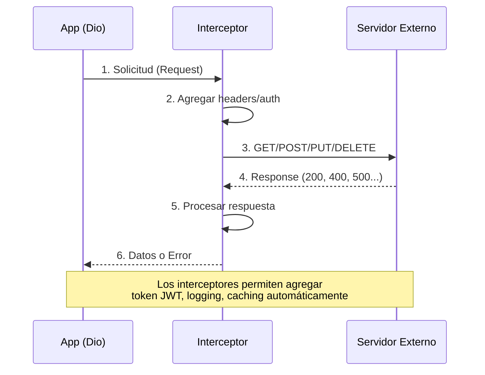

# Consumo de APIs con HTTP y Dio {#sec-apis}

> **Relación con Clean Architecture**: Los clientes HTTP (como Dio) pertenecen a la capa INFRASTRUCTURE. Ver [@sec-clean-architecture] para entender cómo el Repository pattern abstrae las llamadas HTTP del DOMAIN.

En el desarrollo profesional, rara vez trabajamos con datos estáticos. Como facilitador, quiero que domines el arte de solicitar, recibir y procesar información desde servidores remotos.

## HTTP vs Dio

Aunque Flutter tiene un paquete `http` oficial, en este curso recomendamos **Dio** para proyectos medianos y grandes debido a sus características avanzadas:

- **Interceptores**: Permiten añadir tokens de autenticación o loguear peticiones globalmente.
- **Configuración Global**: Define una `BaseURL` y timeouts en un solo lugar.
- **Cancelación de Peticiones**: Útil para ahorrar recursos cuando el usuario sale de una pantalla.

## Flujo de una Petición con Dio



**Flujo**: Los拦截adores (interceptors) son middleware que procesan cada request/response globalmente.

## Realizando una Petición GET

```dart
final dio = Dio(BaseOptions(
  baseUrl: 'https://api.themoviedb.org/3',
  queryParameters: {
    'api_key': 'TU_API_KEY',
    'language': 'es-MX'
  }
));

Future<void> getMovies() async {
  final response = await dio.get('/movie/now_playing');
  print(response.data);
}
```

::: {.anti-ia-challenge}
**Manejo de Errores**: ¿Qué pasaría con tu aplicación si el servidor devuelve un error 500 o si el usuario no tiene conexión a internet? Investiga cómo usar un bloque `try-catch` con `DioException` para capturar estos escenarios y mostrar un mensaje amigable.
:::
