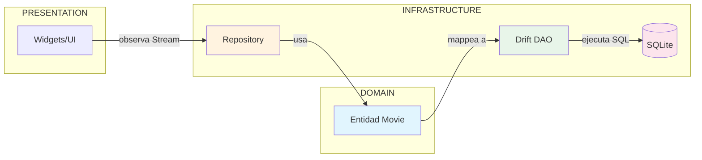

# Persistencia Local con Drift (SQLite) {#sec-sqlite}

> **Conexión con Clean Architecture**: En [@sec-capas-sagradas], la capa de INFRASTRUCTURE utiliza el patrón Repository. Drift implementa los DAOs que conectan tus entidades del DOMAIN con la base de datos SQLite.

En aplicaciones móviles profesionales, a menudo necesitamos que los datos estén disponibles sin conexión (Offline-first). Como facilitador, quiero presentarte **Drift**, un generador de código que hace que trabajar con SQLite en Flutter sea seguro y reactivo.

## ¿Por qué Drift?

- **Type-safe**: Errores en tiempo de compilación para tus consultas SQL.
- **Streams reactivos**: La UI se actualiza automáticamente cuando los datos cambian en la base de datos.
- **Migraciones**: Facilita el cambio de esquema de la base de datos entre versiones de la app.

## Arquitectura Drift en Clean Architecture



**Flujo**: La UI observa un Stream del Repository, que internamente usa el DAO de Drift para ejecutar SQL en SQLite.

## Definiendo una Tabla

Con Drift, definimos las tablas usando clases de Dart:

```dart
class Movies extends Table {
  IntColumn get id => integer().autoIncrement()();
  TextColumn get title => text().withLength(min: 1, max: 200)();
  TextColumn get overview => text()();
  DateTimeColumn get releaseDate => dateTime().nullable()();
}
```

## Operaciones CRUD Básicas

```dart
@DriftDatabase(tables: [Movies])
class AppDatabase extends _$AppDatabase {
  // ... constructor ...

  // Obtener todas las películas como un Stream
  Stream<List<Movie>> get allMovies => select(movies).watch();

  // Insertar una nueva película
  Future insertMovie(MoviesCompanion movie) => into(movies).insert(movie);
}
```

::: {.anti-ia-challenge}
**Optimización de Almacenamiento**: SQLite es potente, pero ¿cuándo es preferible usar una base de datos local frente a guardar datos en archivos planos o SharedPreferences? Justifica tu respuesta considerando el volumen y la estructura de los datos.
:::
